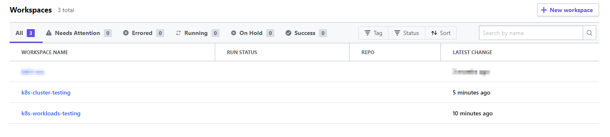
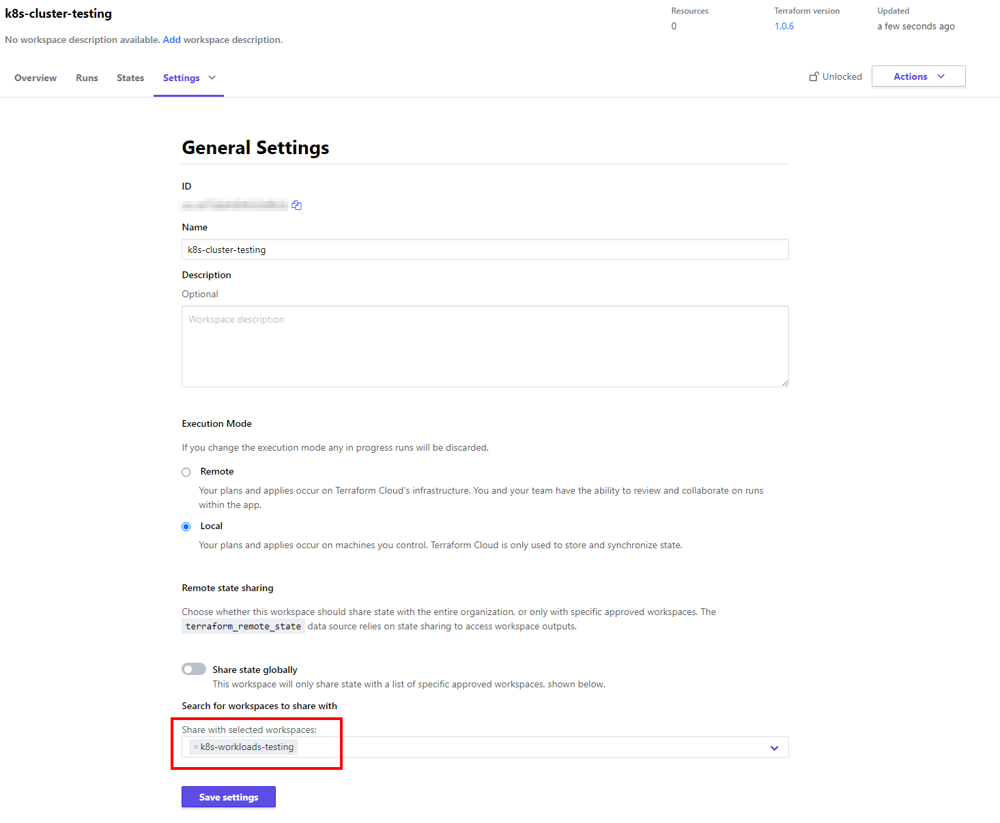
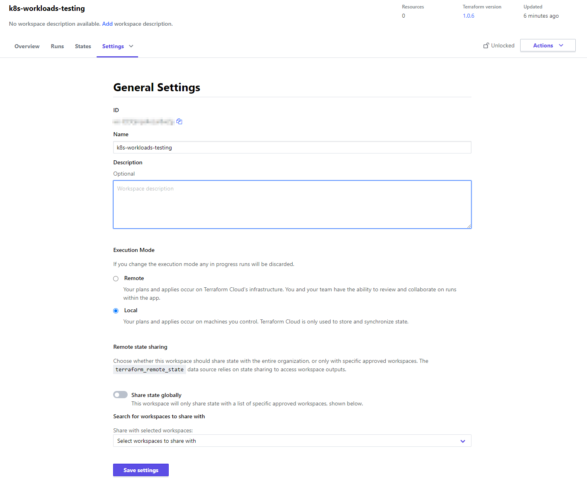

# Terraform Cloud

If you are using Terraform Cloud to save your state files you will need to do a few short steps to ensure this project works for you:

## Steps

1. Create a Terraform workspace
1. Add your organization and workspace to the `terraform\k8s-cluster\versions.tf` file
1. Done! 🎉

> Note: There are old docs below to reference if you want. The steps above should be all you need

---

## OLD DOCS (deprecated)

> Note: This is an old docs section that is being preserved for reference. This is for building the cluster and the resources with pure Terraform and no K8s yaml manifests

> If you followed the steps above you should be done

1. Create two seperate workspaces (example below)

    

1. Share your Terraform State from your `k8s-cluster` workspace to your `k8s-workloads` workspace. This is necessary as you need access to the `k8s-cluster` state in order to provision new `workloads` (example below)

    `k8s-cluster` Terraform workspace settings:

    

1. Below is the `k8s-workloads` Terraform settings. We do not need to make any additional changes here but I am including it just as a reference point (example below)

    `k8s-workloads` Terraform workspace settings:

    

1. That's it! Now your `k8s-cluster` state will be shared with `k8s-workloads` so you don't get errors!

> Note: The other setting you may have noticed is that `Execution Mode` is set to `Local` in my settings. This is a personal prefernce as I setup my GitHub actions works flows for deployments in a specific manner. This has no effect on the sharing of Terraform state.
